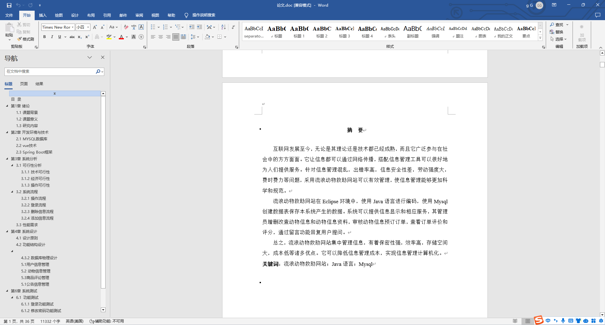
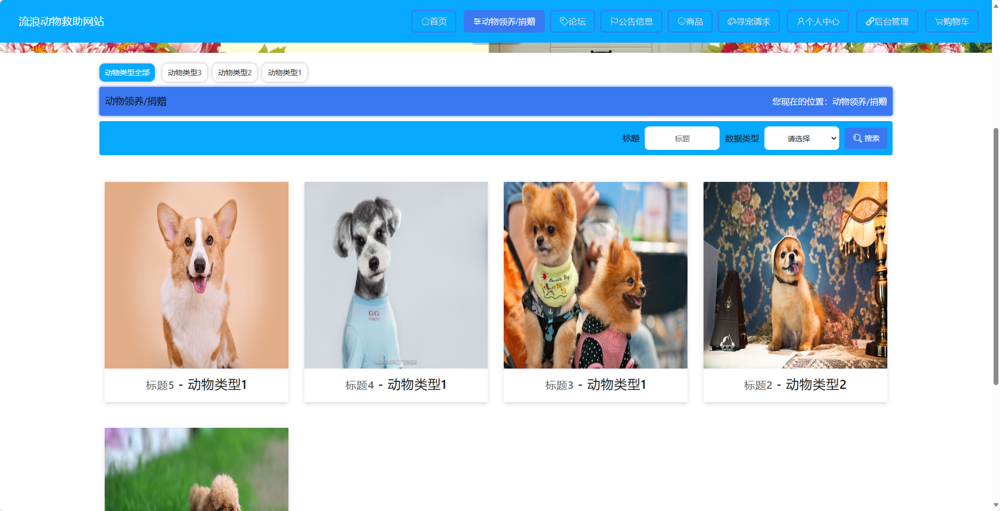
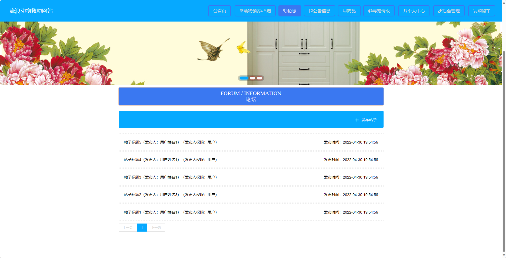
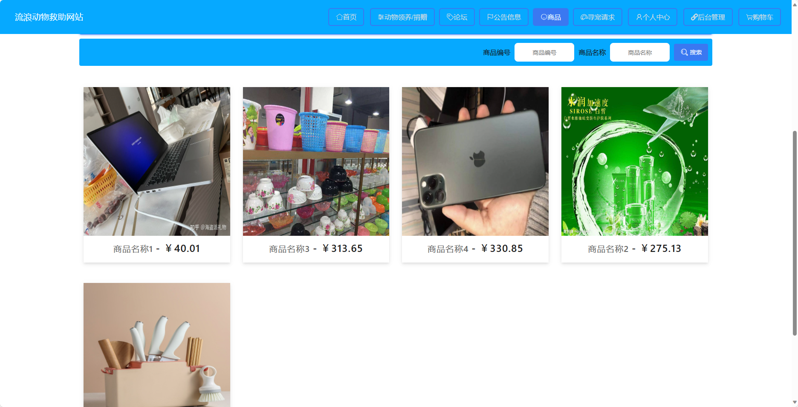
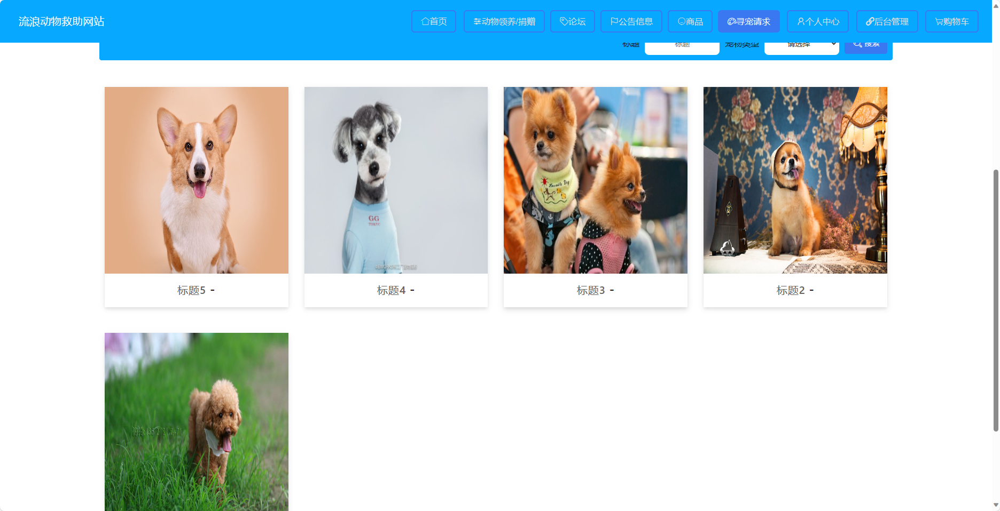
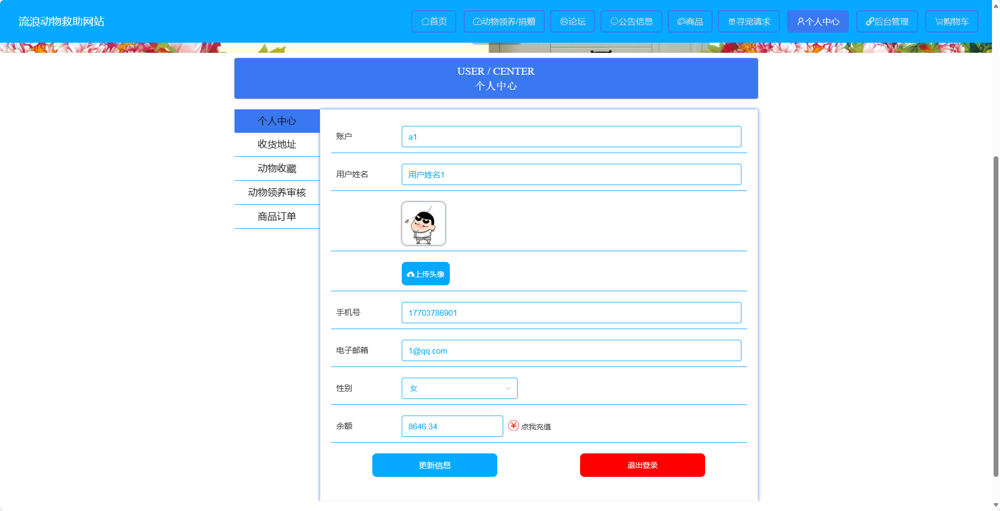
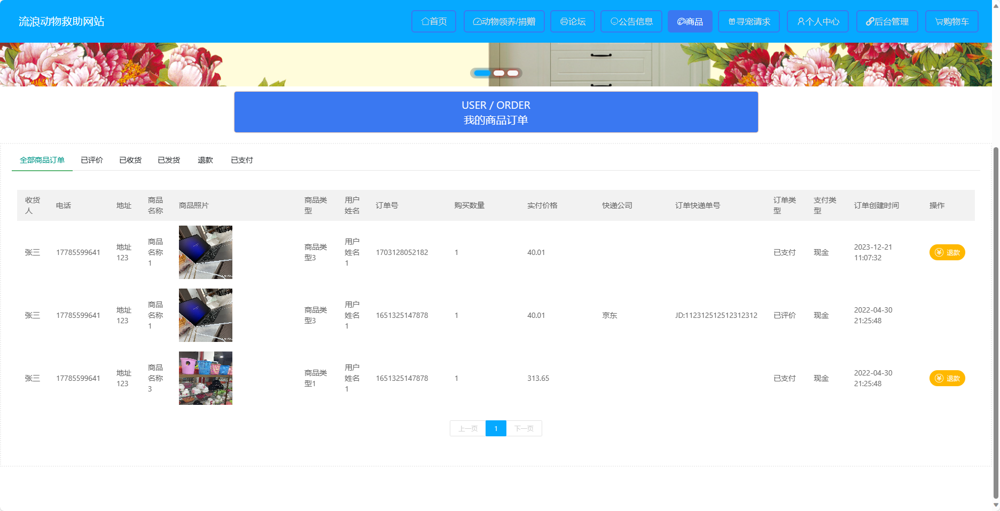
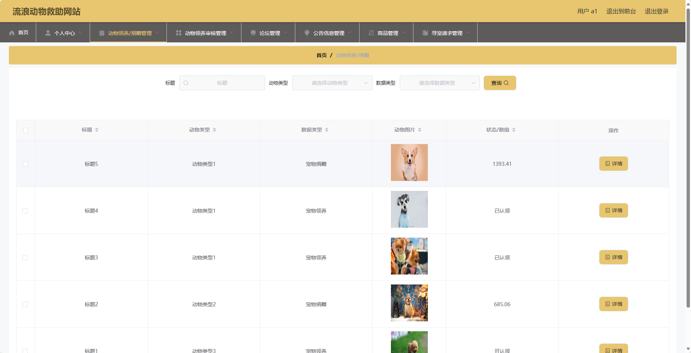

## 基于SpringBoot的流浪动物救助网站(程序+报告)

###  获取sql数据库文件: 从戎源码网 (https://armycodes.com/) QQ: 386869957 QQ群: 377586148
###  所有系统地址: (https://github.com/YuLin-Coder/AllProjectCatalog) 
###  所有项目以及源代码本人均调试运行无问题 可支持远程安装部署调试、定制修改、代码讲解

## 项目介绍
基于SpringBoot的流浪动物救助网站，系统包含两种角色：管理员、用户,系统分为前台和后台两大模块，主要功能如下。

### 【管理员】:
- 管理员管理：管理管理员账号和权限。
- 动物领养审核管理：审核和管理动物领养申请。
- 基础数据管理：管理系统的基础数据，如动物种类、品种等。
- 论坛管理：管理论坛中的帖子和评论。
- 公告信息管理：发布和管理公告信息。
- 商品管理：管理平台上的商品信息和库存。
- 寻宠请求管理：处理用户发布的寻宠请求。
- 用户管理：管理用户的信息和权限

### 【用户】:
- 个人中心：管理个人信息。
- 动物领养/捐赠管理：处理用户提交的动物领养/捐赠申请。
- 动物领养审核管理：审核和管理动物领养申请。
- 论坛管理：管理论坛中的帖子和评论。
- 公告信息管理：发布和管理公告信息。
- 商品管理：管理平台上的商品信息和库存。
- 寻宠请求管理：处理用户发布的寻宠请求。

### 【前台】:
- 动物领养/捐赠：用户可以浏览和申请领养/捐赠流浪动物。
- 论坛：用户可以在论坛中交流关于流浪动物救助的经验和信息。
- 公告信息：发布流浪动物救助相关的公告信息。
- 商品：展示和购买与流浪动物有关的商品。
- 寻宠请求：用户可以发布寻找走失宠物的请求。
- 个人中心：管理个人信息和相关操作。
- 购物车：用户可以将感兴趣的商品加入购物车进行批量购买。

## 项目技术
- 编程语言：Java
- 数据库：MySQL
- 项目管理工具：Maven
- 前端技术：HTML、CSS、JavaScript、Jquery、Vue
- 后端技术：Spring、SpringMVC、MyBatis

## 运行环境
- JDK版本：JDK1.8及以上
- 开发工具：IDEA、Ecplise、Myecplise都可以
- 数据库: MySQL5.7及以上
- Maven：maven3.0及以上
- Node：14.14.0及以上

## 运行截图

